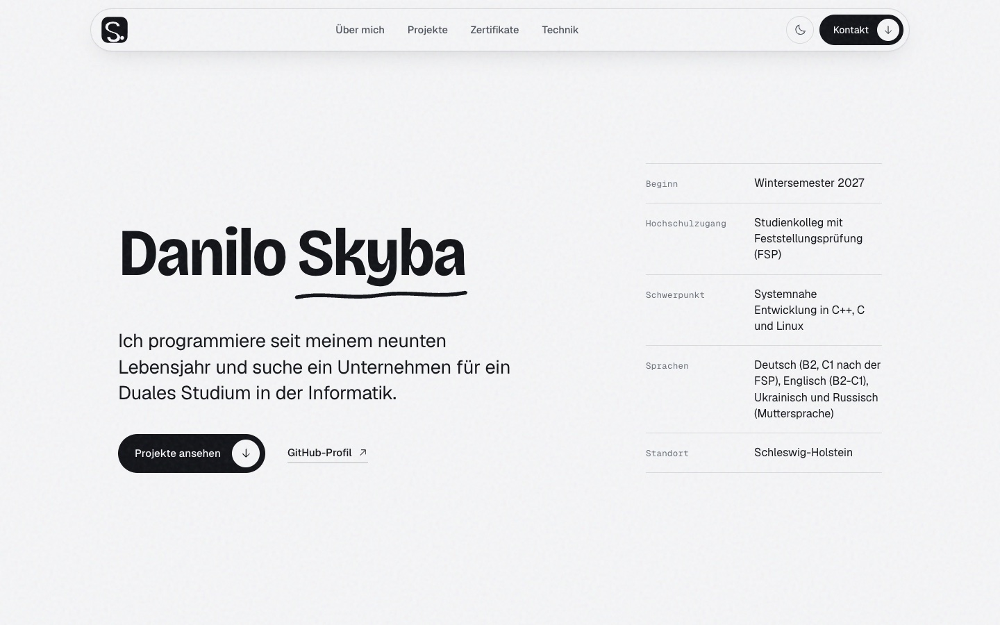

# skyba.dev

Meine persönliche Website. Sie ist gerade vor allem eine Bewerbung für ein Duales Studium in der Informatik: wer ich bin, woran ich gebaut habe, welche Nachweise ich habe und wie man mich erreicht. Live unter [skyba.dev](https://skyba.dev).



## Wie die Seite gebaut ist

Astro, komplett statisch. Es gibt kein Frontend-Framework im Browser, nur ein paar kleine Skripte für den Theme-Umschalter, das Menü, die Scroll-Animation und die Neigung der Projektkarten. Tailwind 3 übernimmt nur das Layout, Farben, Schriften und Bewegung stehen als Design-Tokens und normales CSS in `src/styles/`.

- Schriften kommen lokal über Fontsource (Bricolage Grotesque, Geist, Geist Mono, Newsreader). Von Google wird nichts geladen.
- Technologie-Logos sind aus [Simple Icons](https://simpleicons.org), alle anderen Icons aus [Phosphor](https://phosphoricons.com). Welcher Begriff welches Icon bekommt, steht in `src/components/TechIcon.astro`.
- Schwarz-weiß, mit hellem und dunklem Modus. Eine Akzentfarbe gibt es absichtlich nicht.
- Keine Cookies, kein Tracking. Gehostet wird auf Vercel.

## Lokal starten

Node 22 wird empfohlen.

```sh
npm install
npm run dev      # http://localhost:4321
npm run build    # Ausgabe in dist/
```

## Inhalte ändern

Texte, Links, Projekte und Zertifikate stehen in `content/landing.json`. Nach einer Änderung reicht ein Build.

| Feld | Was es steuert |
| --- | --- |
| `person` | Name, E-Mail, GitHub, LinkedIn, Standort |
| `person.cv_url` | Pfad zu einer PDF in `public/`. Sobald gesetzt, erscheint im Kontaktbereich ein Lebenslauf-Link. |
| `person.photo` | Porträt im Hero (Format 4:5). Ist zurzeit bewusst leer. |
| `hero.facts` | Die Fakten neben dem Namen |
| `projects.items` | Projektliste, Icons ergeben sich aus den Stack-Namen |
| `certificates.items` | Credly-Badges, Bilder liegen in `public/badges/` |
| `stack.groups` | Die Spalten im Bereich "Technik" |

## Ordner

```
content/landing.json   alle Inhalte
public/                Favicon, OG-Bild, Badge-Bilder
scripts/og.mjs         rendert public/og.png aus den Seitenstilen
scripts/shots.mjs      Screenshots für die Sichtprüfung (Desktop, Mobil, hell, dunkel)
src/components/        Bausteine der Startseite
src/layouts/           Base (Head, Header, Footer) und Page (Textseiten)
src/pages/             index, datenschutz, 404
src/styles/            Tokens und globales CSS
vercel.json            Header und Caching
```

`DESIGN.md` beschreibt das Designsystem, `PRODUCT.md` Zielgruppe und Ziele der Seite. Die Skripte in `scripts/` brauchen Node 22 und Google Chrome unter `/Applications`.

## Deployment

Push nach `main`. Vercel baut mit `npm run build` und liefert `dist/` aus.

## Noch offen

Nach der Feststellungsprüfung müssen in `hero.facts` das Deutsch-Niveau und der Hochschulzugang aktualisiert werden.
